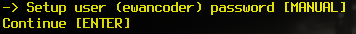
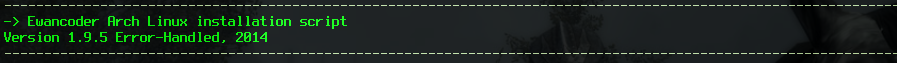
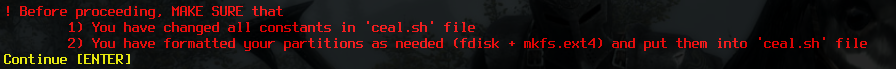

.. _ceal.sh: https://github.com/ewancoder/eal/blob/master/ceal.sh
.. _tput: https://en.wikipedia.org/wiki/Tput

Development Guide
*****************

This page is intended to help anyone who interested in how-script-work-inside magic. Here will be detailed explanation of each and single line of script code.

CEAL script
===========

The `ceal.sh`_ script is basically configuration file with lots of variables setting up, but at the end of a file there's little section which defined **mess** (message) function and its stiling.

You can read about configuration part at the :ref:`configuration` section of :ref:`use` page.

.. _stylization:

Stylization
-----------

In `ceal.sh`_ we have **interface** section which is responsible for script stylization, printing text in different colors and making pauses. Here will be detailed described **mess** function and stylization variables.

Now, we have styling variables here:

.. literalinclude:: ../ceal.sh
   :language: bash
   :start-after: Output styling
   :end-before: Message function

All these does is setting specific color or styling. `tput`_ command is used for setting a style like this:

+--------------+---------+
| tput setaf 1 | red     |
+--------------+---------+
| tput setaf 2 | green   |
+--------------+---------+
| tput setaf 3 | yellow  |
+--------------+---------+
| tput bold    | bold    |
+--------------+---------+
| tput sgr0    | default |
+--------------+---------+

.. note::

   We need to set color back to default at the end of printing out text onto the screen because if we wont, all other text will be printed out with distorted styling.

**Mess** function is intended to printing stylizied messages onto the screen while installation process proceeds. So each step of the script will be commented with the help of this function for you to see what's going on.

Pacman preparation
##################

.. literalinclude:: ../ceal.sh
   :language: bash
   :start-after: mess(){
   :end-before: if [ "$

This is basically removes file */var/lib/pacman/db.lck* if it exists. It is done on each step just to be sure that this file is not exist when **pacman** starts doing its work. When you're using SSD for your main partitions, pacman could be very quickly and if the script working in an **auto** mode (see :ref:`auto`) pacman just doesn't have time to remove the file.

Getting options
###############

Next block of code defines do we have any **options** given to the script (like ``-p``, ``-t``, ``-w`` or ``-q``).

.. code-block:: bash

   if [ "${#1}" -gt "2" ]; then
      m=$1
      o=$2
   else
      o=$1
      m=$2
   fi

If **length** of the first **parameter** given to a script is **greater** than 2 symbols, **$m** variable will become this first parameter, and **$o** variable will become the second parameter (if it was given). For example, ``mess lol``. Here first parameter is greater than 2 symbols (it's 3), so ``m=lol`` and ``o=''``.

Else (if the length is lower or is equal to 2) first parameter will be given to **$o** variable and **$m** will be the second. For example, ``mess ha lol``. Here first parameter is equal to 2 symbols, so ``m=lol`` and ``o=ha``.

Why do we need this block of code? Because it's unlikely that someone wish to print out a text with the lenght lower than 2 symbols, but options (``-t``, ``-q``) is 2 symbols lenght. So we can now pass an option first and the text the second and it will transfer well.

.. code-block:: bash

   mess -t "This is printed in green colors, because -t option is stays for 'Title' and the title is green"

Stylization
###########

Next block of code defines stylization for different options. You can add lots of different options here or change existing ones.

.. literalinclude:: ../ceal.sh
   :language: bash
   :start-after: m=$2
   :end-before: echo -e $Style

Here we're setting 3 variables:

* **Style** - styled string which will be printed out onto the screen
* **Pause** - if equal to **1**, script will be paused no matter what is **auto** variable
* **Line** - just temporary variable for **title** style sake - horisontal lines with the width of the screen
* **step** - this variable is responsible for **error-handling** mechanism (see also :ref:`error_handling`). If it's set to something, this will be printed by error-handling mechanism. So I'm setting it to **$m** variable, but only if there was no options given (this is just regular step in the script) or if ``-p`` or ``-t`` options were given (pause and title). There will be no use of ``-w`` and ``-q`` options being error-handled.

Different styles
################

Pause
~~~~~

**Pause style** is used when you need to force-pause script and tell user that he is going to do something. For example, if you want user to enter password or to edit some file use pause style.

The option is ``-p``.

.. literalinclude:: ../ceal.sh
   :language: bash
   :start-after: "-p")
   :end-before: "-t")

Title
~~~~~

**Title style** is used for block of code united with the one goal. Also, it is used to print out the whole scipt's title.

The option is ``-t``.

.. literalinclude:: ../ceal.sh
   :language: bash
   :start-after: "-t")
   :end-before: "-w")

Warning
~~~~~~~

**Warning style** is used when you need to force-pause script plus print out something with big red font and exlamation sign. For example, it is used to remind user that he should change `ceal.sh`_ file and format drives before installation.

The option is ``-w``.

.. literalinclude:: ../ceal.sh
   :language: bash
   :start-after: "-w")
   :end-before: "-q")

Question
~~~~~~~~

**Question style** is used just for error-handling question (y/n). It is also red and differs from **warning style** just a little bit. Also, it hasn't force-pause thing.

The option is ``-q``.

.. literalinclude:: ../ceal.sh
   :language: bash
   :start-after: "-q")
   :end-before: "")

Default
~~~~~~~

Default style is just for the regular messages of what is going on now. It is used at almost the each line of a script (at the each step).

This is applied if there's no options.

.. literalinclude:: ../ceal.sh
   :language: bash
   :start-after: "")
   :end-before: "esac")

The core
########

So far, we've only set all variables. Where's the actions? Here are they:

.. literalinclude::
   :language: bash
   :start-after: esac
   :end-before: }

Here we're just **echo-ing** our **Style** variable which already contains all the styles and the message. Then we're checking two variables:

* Pause - if it's 1, we need to force-pause the script
* auto - if it's 0, then we're force-pausing script anyway (on each step)

But inside the cycle, we're checking two more things: if ``-t`` or ``-q`` options were **NOT** given, we're printing yellow string *"Continue [ENTER]"* and **waiting for input** (this is pause itself). This is needed for skipping **titles** and **questions** even if the **auto** variable was being set.

Install script
==============

HEAL script
===========

EAL script
==========

PEAL script
===========
