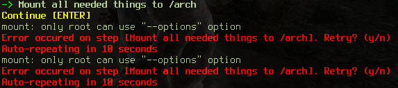

.. _dotfiles repo: https://github.com/ewancoder/eal
.. _all 5 files: https://github.com/ewancoder/eal
.. _zip archive: https://github.com/ewancoder/eal/archive/master.zip
.. _al.sh: https://ewancoder.github.io/al.sh

.. _clone: https://help.github.com/articles/github-glossary#clone
.. _curl: https://en.wikipedia.org/wiki/CURL
.. _wget: https://en.wikipedia.org/wiki/Wget
.. _fdisk: http://tldp.org/HOWTO/Partition/fdisk_partitioning.html
.. _mkfs.ext4: https://wiki.archlinux.org/index.php/ext4
.. _squashfs: https://en.wikipedia.org/wiki/SquashFS
.. _grep: https://en.wikipedia.org/wiki/Grep
.. _sed: https://en.wikipedia.org/wiki/Sed
.. _udev: https://wiki.archlinux.org/index.php/udev#Writing_udev_rules

.. _ceal.sh: https://github.com/ewancoder/eal/blob/master/ceal.sh
.. _install.sh: https://github.com/ewancoder/eal/blob/master/install.sh
.. _eal.sh: https://github.com/ewancoder/eal/blob/master/eal.sh
.. _heal.sh: https://github.com/ewancoder/eal/blob/master/heal.sh
.. _peal.sh: https://github.com/ewancoder/eal/blob/master/peal.sh

User Guide
**********

This is complete user guide for Ewancoder / Effective&Easy Arch Linux installation script, getting it, configuring and executing. Jump to :ref:`configuration` if you want some info upon `ceal.sh`_ file and setting script for your needs.

Where to get
------------

You need to download **5 files** from my `dotfiles repo`_. There's already a script for that, so just run

.. code-block:: bash

   bash <(curl ewancoder.github.io/al.sh)

All this command does is runs via `curl`_ the **al.sh** script which downloads all five files in current directory:

* `ceal.sh`_ - **constants** eal, main configuration file
* `install.sh`_ - main file which you need to **execute** to start installation after editing ceal.sh
* `eal.sh`_ - the main script for installing base-system from live-cd
* `heal.sh`_ - **host** eal, for downloading and preparing live-cd itself from within working linux system
* `peal.sh`_ - **post** eal, for installing and configuring all software (running from within chroot after installing base-system)

.. note::

   Script is using `curl`_ and not `wget`_ because Arch Linux live cd have curl as default and doesn't have wget.

Alternatively, you can

* download `al.sh`_ and execute it manually
* download `all 5 files`_ by-hand
* `clone`_ my repository (but this is unnecessary and irrational for install purpose)
* download it as a `zip archive`_

How to start
------------

You only need to:

#. **Format** (and partition if needed) your drives

   For example, use `fdisk`_ to partition your drives and `mkfs.ext4`_ to format your partitions.

#. **Configure** the `ceal.sh`_ script (see :ref:`configuration` section)
#. **Start** `install.sh`_ script (Just run ``./install.sh``)

EAL script reads **ceal.sh** file and then do all its magic based on constants which you **should** set first. The script is very **flexible** in terms of changeability and it's going to be much more flexible and perfect with your help and feedback.

.. warning::

   Do NOT try to execute script (install.sh) before you change **ceal.sh** constants. It have drives like /dev/**sdb5** and users like **ewancoder**, so you probabbly want to change all the constants for your liking (or at least, partition your drives like this).

.. _configuration:

Configuration
-------------

This chapter is detailed description of the each variable withing the `ceal.sh`_ file.

1. Version
==========

There's nothing to configure. This variable shows current **version** of a script.

.. code-block:: bash

   version="1.9.5 Error-Handled, 2014"

2. Error-handling
=================

When there will an **error** occur within a script - you will be prompted with a question either you wish **to repeat or to continue** (skip the error). If for example you're installing some packages with pacman and there's an internet connection randomly goes down - you're probably will want to repeat the command. It is the default action.

EAL script can do it automatically if an error was detected. This is useful if you're installing script automatically (with **auto** switch turned on, see :ref:`auto`) and go for a walk at that time. You don't want to go back and see that some random error taked place at the beginning of the script and did not proceed further, do you?

.. code-block:: bash

   timeout=10

Set this variable to **number of seconds** after which the command will be executed again. Set it to 0 if you don't want to use this feature.

3. Host system or live-cd
=========================

If you'd like to install Arch Linux from within your **already working (arch) linux** (but onto the other hdd/ssd partitions, of course) - this variables would do the trick.

.. note::

   I am writing (arch) in brackets because I'm going to make it possible to install arch linux from within ANY distribution (it's not as hard as it seems to be).

If you have live-cd, you can just reboot into it and run script without this feature. For that set ``hostinstall=0``. Otherwise, installation process will go through downloading live-cd, chrooting into it and installing arch linux from within your working distro (this is pretty cool and you can do your work in the meantime).

.. code-block:: bash

   hostinstall=1

Also you should check ``iso`` variable. It should be a working link to the root `squashfs`_ live-cd image. It is working now, so you could just leave it alone.

.. code-block:: bash

   iso=http://ftp.byfly.by/pub/archlinux/iso/2014.06.01/arch/x86_64/root-image.fs.sfs

.. _auto:

4. Automatic install
====================

If you want to monitor EACH step of the script and give your permission to do it, leave ``auto=0`` as 0. If you want script to do all **automatically** so you could do your other work in the meantime - set ``auto=1``. Anyway, there's cool error handling system (see :ref:`error handling`) which will stop the script if something goes wrong. But by using first option you can **see** what actually going on and **learn** how script works, so for the first time leave it as 0.

.. code-block:: bash

   auto=0

Be AWARE: If you change auto to 1, all installation process will go as fast as your computer could think, download files and install packages. And this is pretty awesome when you just want to install your system and do your other stuff in the meantime :)

5. Font and locales
===================

As archwiki tells us, we should set **console fonts** for displaying some character (for example, for russian utf-8 fonts it's cyr-sun16).

.. code-block:: bash

   font=cyr-sun16

And, as well, we need our **locales** set in **bash array**.

.. code-block:: bash

   locale=( en_US.UTF-8 ru_RU.UTF-8 )

Just list all locales you want to include separated by whitespace like in the example.

.. note::

   If you need only one value in a **bash array**, you can always remove brackets and make it a **variable** like this: ``locale=en_US.UTF-8``.

6. Hostname and timezone
========================

This is the **hostname** of your PC and your **timezone**. Hostname is the name of your PC, you should make it yourself. Timezone is linked file which is located at the */usr/share/zoneinfo* folder.

.. code-block:: bash

   hostname=ewanhost
   timezone=Europe/Minsk

7. Mirrorlist
=============

Mirrorlist is formed by using `grep`_ from */etc/pacman.d/mirrorlist* file on live-cd. So just include all countries' names respectively to importance. For example, here Belarus goes first, then all other countries. And United stays both for United States and for United Kingdom.

.. code-block:: bash

   mirror=( Belarus Denmark Russia United France )

8. Internet configuration
=========================

Internet can be configured 2 ways:

* dhcpcd - the most easiest way. It does not require any configuration and runs out of box because it is dhcp receiver. Although, dhcp server should be set on your router and you should have ethernet connection (I've not experienced wi-fi connection over dhcpcd, although it is possible)
* netctl - powerful and easy-to-setup network manager which is stable, ensures good connection over any interfaces with any settings and contains lots of pre-configured profiles as examples

.. code-block:: bash

   netctl=1

If you set ``netctl=0`` - you will use dhcpcd service. Otherwise - you should set all other params that you need to use netctl.

.. code-block:: bash

   profile=wireless-wpa-static

Profile is one of the profiles in /etc/netctl/examples folder which will be copied and edited by `sed`_ based on your config values. You can choose *ethernet-dhcp*, *ethernet-static*, *wireless-open*, *wireless-wpa-static*, etc.

.. note::
   
   I am currently using **wireless-wpa-static** because my Raspberry PI needs my ethernet cable.

.. warning::

   **WPA** profiles need **wpa_supplicant** package which handles wpa encryption. So make sure you have one in **software** section below (see :ref:`software`)

Next, you should definitely configure network interface. You could run ``ip link`` command to know which interfaces do you have. It's going to be something like *enp2s0* or *wlp3s5*. Mine is **wlan** just because I have applied special rules to `udev`_.

.. code-block:: bash

   interface=wlan

If you're using **static** ip address (alongside with static netctl profile), you should definitely setup **ip**. Also you need to setup **dns** and **gateway** to be able to connect to your router.

.. code-block:: bash

   ip=192.168.100.22
   dns=192.168.100.1

.. note::

   With netctl dns is not a network dns, it's address of your router (because you connect to it firstly).

.. warning::

   In my current configuration **dns** and **gateway** are the same, so I made them as one variable - **dns**. If you have different dns&gateway, you can connect me and I'll improve my script a little bit more.

If you're connecting via wi-fi (and maybe using encryption) you will need ESSID & PassKey to connect to your access point. There are easily set up here too.

.. code-block:: bash

   essid=TTT
   key=192837465

9. Devices
==========

EAL script does **NOT format** your drives. You should do it youself (preferably with `mkfs.ext4`_ command). Then you can configure these drives in `ceal.sh`_ to automount them and add to fstab during install.

All variables are arrays with corresponding values. For examle

.. code-block:: bash
   
   device=( /dev/sdb5 /dev/sdb6 )
   mount=( / /home )

This means that **/dev/sdb5** will be mounted to **/** and **/dev/sdb6** will be mounted to **/home**.

All devices should be set in the order of mounting. **/home** could not go before **/**. The first and mandatory device is **/** - root.

**Description** is just text description of the mounted drive. I have 4 devices mounted in my system: root, home, cloud and backup.

.. code-block:: bash

   description=( Root Home Cloud Backup )

**Device & mount** are the actual devices and their mount points.

.. code-block:: bash

   device=( /dev/sdb5 /dev/sdb6 /dev/sdb4 /dev/sda5 )
   mount=( / /home /mnt/cloud /mnt/backup )

**Type**, **option**, **dump** and **pass** are the options in the fstab file. **Pass** should be 1 for root partition and 2 for all other. **Dump** is usually 0 for all of them.

.. code-block:: bash

   type=( ext4 ext4 ext4 ext4 )
   option=( rw,relatime,discard rw,relatime,discard rw,relatime,discard rw,relatime )
   dump=( 0 0 0 0 )
   pass=( 1 2 2 2 )

.. warning::

   **Discard** option is used only for SSD to minimize wear leveling count, do not try to use it on HDD.

And we need to set some additional devices. First - we need to point out which device will be used to store **grub bootloader**. It is usually your drive where root partition is located.

.. code-block:: bash

   mbr=/dev/sdb

If you have Windows OS installed on your machine and you want to automatically **copy all fonts** from *c:\\windows\\fonts* to */usr/share/fonts/winfonts*, set **windows** to your windows partition. Otherwise just delete this option (or set it to "").

.. code-block:: bash

   windows=/dev/sdb1

10. Users configuration
=======================

Now you need to configure users.

.. code-block:: bash

   user=( ewancoder lft )

So, users is our usernames declared in bash array.

.. note::

   I have two users: ewancoder (my primary user) and lft (linux future tools, for testing weird stuff).

**Shell** variable is array with shells which will be set to users correspondingly. If not set, it will stay as standard (bash).

.. code-block:: bash

   shell=( /bin/zsh /bin/zsh )

Group is a variable with groups which will be added to corresponding user.

.. code-block:: bash

   group=( fuse,lock,uucp,tty fuse )

Groups itself divided by comma. For example, fuse, lock, uucp and tty groups added to ewancoder user, and only one fuse group added to lft user.

**Main** variable is needed only as **reference**.

.. code-block:: bash

   main=${user[0]}

It serves just as a **reference** to **ewancoder** string. So you can just simply change **ewancoder** to **yourname** and all other stuff in the script which needs your username will be changed to **yourname**.

You can also set **main** to second user like ``main=${user[1]}``. Array elements in bash start from 0.

For each user will be created an entry in **sudoers** file which will allow to use sudo for that user. If you want to add some additional entries in sudoers file (for example, for executing something without password prompt) you can add this additional entry to **sudoers** array. I have 1 entry there which allows me to update system without password prompt.

.. code-block:: bash

   sudoers=( "$main ALL=(ALL) NOPASSWD: /usr/bin/yaourt -Syua --noconfirm" )

11. Executable commands
=======================

If you have complex arch linux ecosystem, you definitely want to execute some of your specific commands at the end of installation process. This is handled by **execs** and **rootexec** variables.

12. Git configuration
=====================

.. _software:

13. Software list
=================

